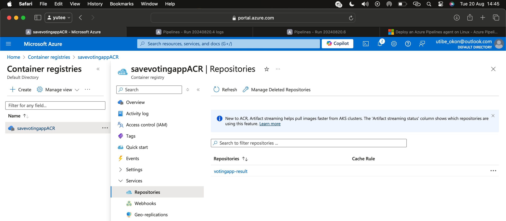

# Setting up CI/CD for a microservices-based appllication using Azure Pipelines
### Migrating ccode from Github to Azure Repos and creating a CI/CD piepline for the project.

__Structure of the application__
__Deliverables, Prerequisites and tools__
Will be working mostly using the azure devops portal

__Step 1:__ Configure self-hosted runners for azure
    - Go to azure portal and create a VM (allow ssh connection, you will need access). Alternatively you can use your local machine which is not advisable.
    - Locate the azure devops pipeline docs and find "manage self-hosted linux agents"
    - Follow the docs: Go to azure devops portal, find organization or project settings >> agent pools >> add pool >> self hosted pool
        
    - Configure settings and create a pool, access the agent pool and click on agents >> new agent >> select platform
        
    - Copy the commands, ssh into your created vm machine and run it on your machine
    - Run the commands to install agent (advisable to upgrade the system if new)
    - Server URL: https://dev.azure.com/<organisation-name>
    - Create PAT on azure devops
    - Enter agent pool
    - Enter agent name
        
    - Agent will be offline if added successuflly until you run the config and the run scripts
    - Install docker (or any dependency you will need on the system to run any of your pipelines, could be node or terraform or python)
    - Give user permissions use docker or any dependency
    - Might have to log out and into the system.
        
    - Test if docker runs and on the account
        
    - Check other resources in case of challenges
    - If runner is properly configured and setup, write pipeline yaml files, test and debug issues

__Step 2:__ Build docker files on changes to the relevant directory and upload to azure container registry.
    Write pipeline yaml files for the rsult services. The pipeline should build the docker image and then push it to azure container registry.
    - Pipeline run and complete
        
        
    - Image onAzure Container Registry
        

__Step 3:__ Pull the docker images and deploy it on a virtual machine.
--to be done after some study--
